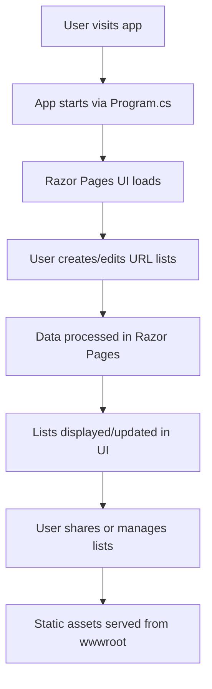

# UrlListApp

UrlListApp is an ASP.NET Core Razor Pages web application for creating, managing, and sharing lists of URLs. It is designed to help users organize collections of links and share them easily with others.

## Features
- Create new URL lists
- Add, edit, and delete URLs in a list
- Share and publish lists via custom or generated URLs
- View and manage all your lists

## Project Structure
- `Pages/` - Razor Pages (UI)
- `wwwroot/` - Static files (CSS, JS, libraries)
- `Program.cs` - App startup and configuration
- `appsettings.json` - App configuration

## How It Works



1. The app starts with `Program.cs`, configuring services and the HTTP request pipeline.
2. Razor Pages are used for the UI, with Bootstrap and jQuery for styling and interactivity.
3. Users can create and manage URL lists through the web interface (feature implementation in progress).
4. Static assets are served from `wwwroot`.

## Getting Started

### Prerequisites
- [.NET 9 SDK](https://dotnet.microsoft.com/) (already included in this dev container)

### Running the App
1. Open a terminal in the project root.
2. Navigate to the `UrlListApp` directory:
   ```bash
   cd UrlListApp
   ```
3. Run the app:
   ```bash
   dotnet run
   ```
4. Open your browser and go to the URL shown in the terminal (usually `https://localhost:5001` or similar).

## Development
- Razor Pages are in `Pages/`.
- Layout and shared UI in `Pages/Shared/`.
- Static files in `wwwroot/`.

## License
This project is for educational purposes as part of the San Antonio GitHub Copilot Bootcamp 2025.
